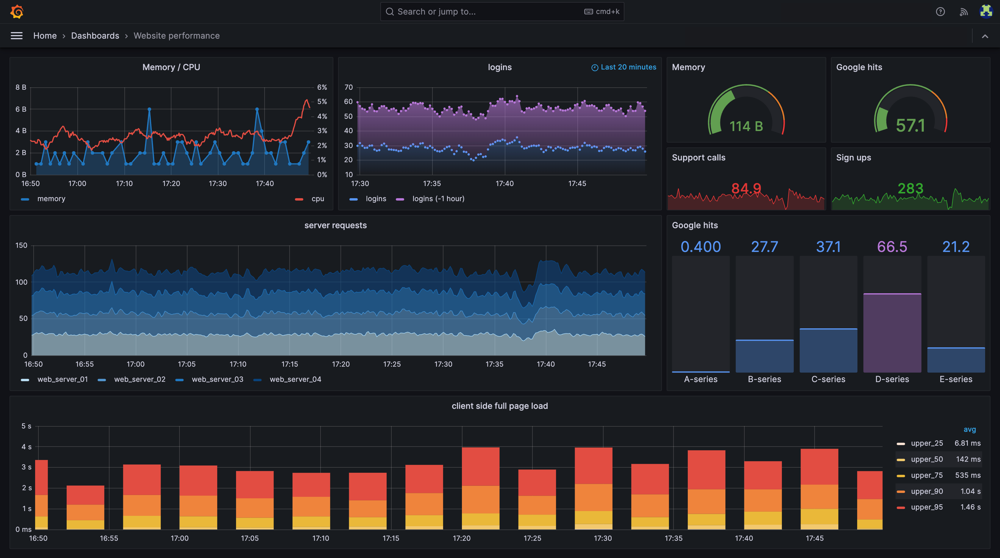

# Fake Grafana & Prometheus Dashboard Simulator 🚀

An interactive, zero-dependency, ultra-lightweight monitoring dashboard that replicates the classic dark theme of **Grafana** and **Prometheus Node Exporter**.

Designed for live demos, presentations, roleplays, training, or hobby testing. Runs directly in any web browser without backend servers, databases, or npm dependencies.



---

## 🌟 Key Features

- **Grafana Authentic Dark Theme**: Precision palette (`#0b0c0e`, `#111217`, `#181b1f`), topbar breadcrumbs, live pulsating dot, time range selector, and incident timeline table.
- **7 Live Real-Time Panels**:
  1. **Response Latency (ms)**: Time-series line chart with dynamic alert color shifting.
  2. **CPU Utilization (%)**: Time-series line chart with threshold boundary alerts.
  3. **HTTP Status Breakdown**: Categorized bar chart (2xx Success vs 4xx Client vs 5xx Server Errors).
  4. **Request Throughput (Req/s)**: Real-time area chart.
  5. **HTTP 5xx Error Rate (%)**: Spikes on critical degradation.
  6. **Network Bandwidth (MB/s)**: Inbound and outbound traffic flows.
  7. **Cluster Storage & Memory Allocation Map (Defrag Matrix)**: Panoramic 384-block matrix inspired by Smart Defrag with live fragmentation rate counter and color-coded cluster states.
- **Interactive CLI Diagnostic Console**:
  - Open anytime by pressing backtick (`` ` ``) or typing `term` / `cli`.
  - Built-in status diagnostics, remediation script simulations (`fix1`..`fix4`), failure testing (`-fix1`), command history (`↑` / `↓`), and `clear` / `help`.
- **100% Offline & Standalone**: Self-contained client-side code with Chart.js included locally.

---

## ⌨️ Global Keyboard Simulation Shortcuts

Type these keystrokes anywhere on the dashboard window:

| Keystroke | Target | Simulation Effect |
| :--- | :--- | :--- |
| `app1d` / `app2d` | App 1 / App 2 | **Degraded (Warning / Amber Alert)**: Latency jumps to ~890ms, CPU ~79%, amber defrag blocks appear |
| `app1k` / `app2k` | App 1 / App 2 | **Critical Outage (Kill / Red Alert)**: Severe timeouts >3.7s, 5xx errors >45%, red alert pulse |
| `app1u` / `app2u` | App 1 / App 2 | **Restore (Healthy Baseline)**: Restores to green 200 OK |
| `` ` `` / `~` / `term` | Global | **Toggle Interactive CLI Diagnostic Console** |
| `?` / `Esc` | Global | **Toggle Shortcuts Guide & Manual Control Center** |

---

## 💻 CLI Terminal Console Commands

Open the console with `` ` `` or `term`:

- `app1 status` / `app2 status`: Streams diagnostic checks reflecting the real-time state (Operational, Degraded, or Critical).
- **Thematic Fixes** (accepts any custom arguments, e.g. `app1 fix1 --force`):
  - `app1 fix1`: 🐳 **Docker Rebuild**: Pulls image layers by hash and spins up container step-by-step (`[1/6]` to `[6/6]`).
  - `app1 fix2`: ⚙️ **Hotfix Compilation**: Compiles Go/Rust modules with a realistic 1.7s build micropause & zero-downtime hot-swap.
  - `app1 fix3`: 🗄️ **Database Pool Purge**: Drains saturated PgBouncer pool (99% full) & purges 14k Redis keys with reindex delay.
  - `app1 fix4`: ☸️ **Kubernetes Rollout**: `kubectl rollout restart deployment` with live pod replica counting (`1/4` to `4/4 ready`).
- `app1 -fix1` .. `app1 -fix4`: Simulates a remediation attempt that **fails** (e.g. OOMKilled, compiler deadlock, lock contention, PDB violation).
- `app1u` / `app2u`: Restores dashboard telemetry metrics to Healthy (Operational).
- `app1d` / `app2d`: Degrades dashboard metrics to Warning (Degraded).
- `app1k` / `app2k`: Triggers Critical Outage on dashboard metrics.
- `clear`: Clear console output.
- `help`: View commands cheat sheet.
- `exit`: Close console modal.

---

## ⚙️ Customization

You can customize application names, descriptions, endpoints, and baseline metrics by editing `js/config.js`:

```javascript
  app1: {
    id: "app1",
    name: "Payments Core API",                                   // <-- Change name here
    shortCode: "PAY-API",                                       // Short acronym
    description: "Transaction processing & payment settlement gateway",
    host: "srv-payments-node-01.prod.internal",
    ip: "10.240.12.44:8080",
    ...
```

---

## 🚀 Getting Started

Simply open `index.html` in any modern web browser (Chrome, Edge, Firefox, Safari):

```bash
# Windows
start index.html

# macOS
open index.html

# Linux
xdg-open index.html
```

---

## 📄 License

MIT License. Free for personal, educational, and commercial use.
